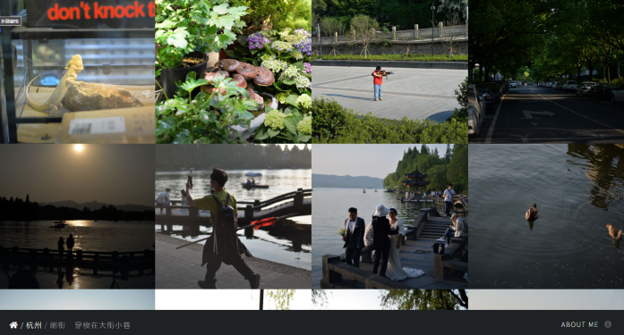

# Personal Photography Blog Generator

> The theme was originally made by HTML5 UP [Multiverse | HTML5 UP](https://html5up.net/multiverse)

DEMO: [https://photograph.wuyiting.cn](https://photograph.wuyiting.cn)

[**中文说明**](https://github.com/kirovj/photography-blog/wiki)

## Change Log

### 2022-6-15

- Add date info
- Show Description at page

## Screenshot



## Features

- Fully Responsive
- HTML5 + CSS3
- FontAwesome Icons
- Multi-level Albums Support
- Basic Breadcrumbs
- Automated Image Fit
- Easy Config With JSON
- Faster


## Usage

1. Clone this repo.

2. Create a file `config.json` in root directory.

   config example:

   ```json
   {
     "title": "My Blog",
     "description": "My Blog description",
     "author": "author name",
     "children": [
       {
         "title": "a dog image",
         "description": "description of this image",
         "url": "a image url"
       },
       {
         "title": "a image collection,",
         "description": "description of this collection",
         "url": "a thumbnail of this collection",
         "children": [ // a collection must have children field
           {
             "url": "a image url"
           }
         ]
       }
     ]
   }
   ```

   **note:**

   - The root node will be used to generate home page.
   - A image collection must have  **children** and **title** field.
   - If a item is collection then  generate a page for it.
   - A single image must have **url** field.

3. Excute generator

   ```bash
   cd project_dir
   ./blog-cli
   
   ```

4. A `public` directory will be created, use it as your server root


## Development

It is a Rust Application.

### Dependencies

- Rust Environment
- Tera
- Serde
- Serde_json
- Urlencoding

### Default Values

Defined in ` src/config.rs`

### Template
The default template is   `template/index.html` and be used by all the pages.
Template Engine is Tera https://tera.netlify.app/docs/.


